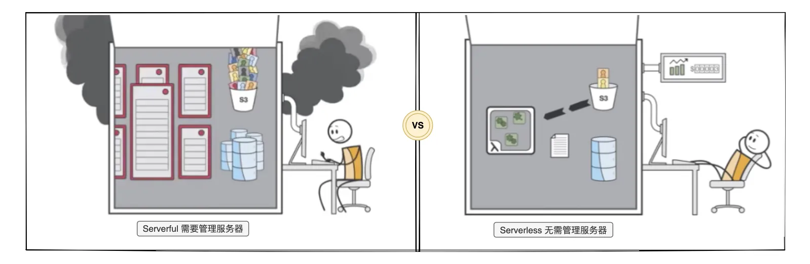

Serverless，又叫无服务器。Serverless 强调的是一种架构思想和服务模型，让开发者无需关心基础设施（服务器等），而是专注到应用程序业务逻辑上。Serverless 也是下一代计算引擎。

**Serverful vs Serverless：**

> Serverless 简化了云计算的编程，其代表了程序员生产力的又一次的变革，如编程语言从汇编时代演变为高级语言时代。-- 简化云编程：伯克利关于 Serverless 计算的观点

## Serverless，FaaS 和托管服务之间的关系

Serverless 与 FaaS（函数即服务）通常被视为可以互换的术语，但这并不准确。Serverless 是一种抽象层次更高的架构模式，而**“FaaS + BaaS”只是 Serverless 这种架构模式的一种实现**。

其中，FaaS 是一种特定类型的服务，例如 AWS Lambda，Google Cloud Functions，Azure Functions，阿里云函数计算和腾讯云函数等等；而 BaaS（后端即服务）可以理解为其他类型的托管服务，例如数据库服务，对象存储服务和日志服务等等。

## Serverless 具有的特质

这里叫特质，而非特性，因为这些属于 Serverless 架构的固有元素，我们无法像处理其它可塑特性那样做出调整。而特质是天然存在的。

- **免运维：**不需要管理服务器主机或者服务器进程。
- **弹性伸缩：**根据负载进行自动规模伸缩与自动配置。伸缩范围零到无穷大。
- **按需付费：**根据使用情况决定实际成本。
- **高可用：**具备隐含的高可用性。

## Serverless First 是什么

在没有 Serverless 之前，传统框架的设计与实现都是以服务器为基础设计，而 Serverless 架构本身的特质带来了与服务器模式之间难以抹平的差异。目前，市面上存在很多专属于 Serverless 的框架，以 Serverless Framework 为代表。基于专属于 Serverless 框架开发的应用几乎只能部署在 Serverless 平台，且业务代码往往与具体 Serverless 平台耦合，难以做到不同平台零代码迁移。

而 Serverless First 框架是一种更为先进地渐进式架构的框架。它即保留了传统开发框架的开发体验，又兼顾了 Serverless 架构特征带来的差异。充分挖掘 Serverless 生产力。

同时，Serverless First 框架也支持在服务器上部署与运行，业务代码完全与具体的运行平台解耦，不同平台之间零代码迁移。

好比前端 UI 框架有移动端优先（Mobile First），思想类似，Serverless Frist 框架优先考虑 Serverless 场景要求，以确保 Serverless 最佳开发体验。当然，您也可以基于 Serverless Frist 框架开发传统服务器应用，选择传统服务器所需要的最佳策略。

## Serverless 价值

**对老板来说：**

- **按需付费**，资源利用率 100%，降低服务器资源成本。
- **免运维**，无需管理服务器，不需要或者需要更少的服务器运维人员。
- **减低创新成本**，通过缩短业务应用开发周期，快速响应变化的需求，不断创新。
- **降低用人成本**，无需为支持高可用高并发买单，对程序员的技能要求相对更低，减少企业用人成本。

简而言之，**对老板来说，Serverless 极大降低企业运营成本，加速业务创新的实现与验证。**
**​**

**对程序员来说：**

- **减低后端开发门槛**，因为无需关注服务器、高并发和高可用相关问题，让后端开发门槛降低
- **聚焦业务逻辑的实现**，而非基础设施（服务器）。
- **原来的后端开发者，做更有挑战的事情**，可以从事做更为后端的开发工作，或者成为全栈。
- **降低成为全栈开发者难度**，全栈程序员能够了解完整的业务逻辑，方便业务应用全链路优化，同时，也减少了前后端沟通成本。

简而言之，**对程序员来说，Serverless 极大降低了后端开发技术门槛，且无需关心服务器底层细节。这些改变，让程序员的 Scope 变得更大，且更有价值。不是像一个螺丝钉一样，而是一个人也能干一件完整的事，完全充分了解业务逻辑，方便做业务与技术融合的创新。**

## 相关链接

- [Malagu 是基于 TypeScript 的 Serverless First、组件化、平台无关的渐进式应用框架](https://github.com/cellbang/malagu)
- [[译]简化云编程：伯克利关于 Serverless 计算的观点](https://zhuanlan.zhihu.com/p/76180907)
- [What is Serverless Architecture? What are its Pros and Cons?](https://hackernoon.com/what-is-serverless-architecture-what-are-its-pros-and-cons-cc4b804022e9)
- [Knative](https://cloud.google.com/knative/)
- [Martin Folwer on serverless architectures](https://martinfowler.com/articles/serverless.html)
