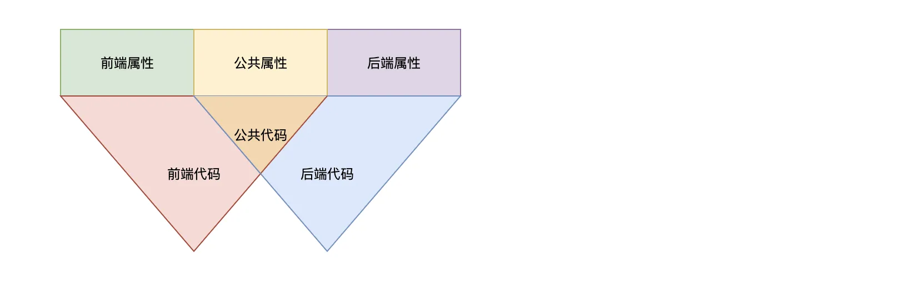
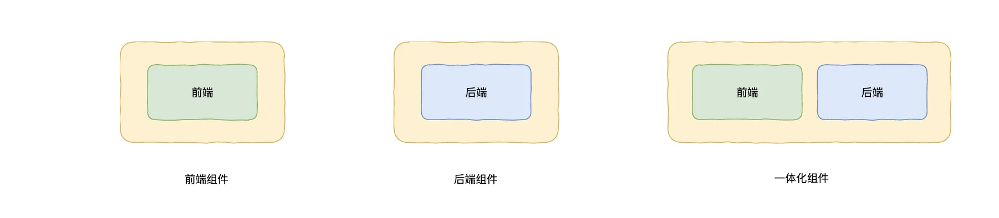
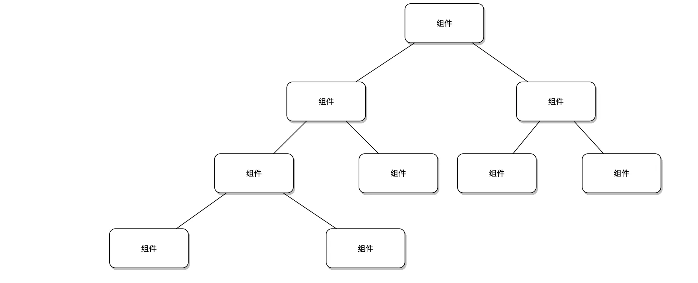
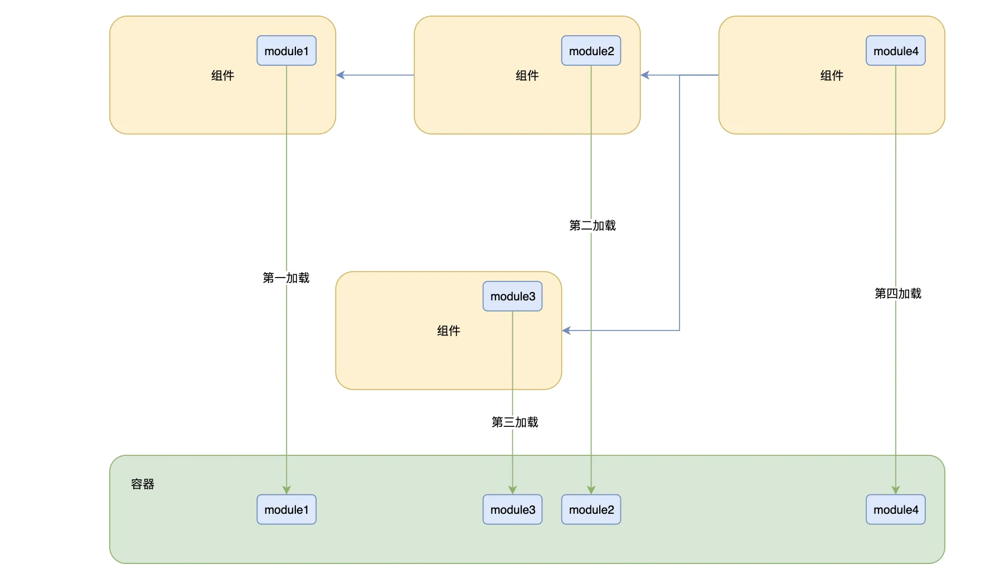

import { LinkCard, CardGrid } from "@astrojs/starlight/components";

前面其实已经多次提到了`Malagu组件`的概念。Malagu 功能的组件化也是 Malagu 最为核心的一个设计理念。

Malagu 这个单词原意是小石头的意思，寓意着 Malagu 的功能就像小石头一样，可以自由地排列组合，从而满足千变万化的真实业务场景。

Malagu 自身基于组件机制实现了很多通用性比较强、开箱即用的基础组件，比如：`Core 组件`、`Web 组件`、`安全组件`、`缓存组件`、`数据库组件`、`前端组件`等等。使用者同样也可以使用组件机制实现属于自己业务领域的一套业务组件，形成自己业务框架，从而进一步简化业务应用的开发，所以 Malagu 也可以作为`框架中的框架`。

Malagu 在实现组件化机制的时候，尽可能复用社区生态已有的基础设施，从而简化学习和实现成本。Malagu 组件复用了 Node.js 的 NPM 包机制。一个组件就是一个 NPM 包，只不过在 NPM 包之上做了少许约定和扩展，是 NPM 包机制的一种自然延伸。

在 Malagu 的世界里，一切皆组件，一个组件可以依赖另一个或者多个组件；Malagu 应用本身也是一个标准的组件。Malagu 目前提供的所有编译时和运行时的能力，都是基于组件实现。有关更多 Malagu 组件详情，请参考文档 Malagu 组件设计。

## 自定义组件

自定义组件与 Malagu 应用的开发没有任何区别。只要我们学会了 Malagu 应用的开发，自然就学会了如何自定义组件。Malagu 也提供了一个初始化模版，帮助我们快速创建一个自定义组件的项目脚手架。命令如下：

```bash
malagu init malagu-component
```

这个模版其实比较简单，主要是基于`@malagu/component`组件搭建了一个支持`编译`、`测试`、`代码风格`、`Watch`等一系列基础设施能力的脚手架。当然不基于`@malagu/component`组件实现也是可以的。

## 组件设计

一个应用随着业务的发展往往会变得越来越复杂和臃肿，不同应用之间又往往存在不同维度的共性。组件化能很好的解决上面的问题：

- 通过将复杂和臃肿的应用横向拆分成一个个业务组件
- 通过把存在共性的不同应用纵向提炼抽象成一个个基础组件

另外，Malagu 框架本身也是一个特别复杂的项目，Malagu 框架同样可以基于自身的组件机制来实现，让 Malagu 框架更具活力。

## 目标

- 可配置性
- 可扩展性
- 可编排性
- 简单易用性
- 可积累性
- 可分享性

## 组件内部结构



- `长方形`表示`组件属性`，包含`前端属性`、`后端属性`和`公共属性`
- `红色三角形`表示`前端代码`
- `蓝色三角形`表示`后端代码`
- `红色和蓝色三角形`交集橙色三角形表示`公共代码`
- 前端代码可以访问`公共代码`、`公共属性`和`前端属性`
- 后端代码可以访问`公共代码`、`公共属性`和`后端属性`
- 公共代码只能访问`公共属性`

<LinkCard title="项目结构" href="/guides/structure" />

## 组件形态

组件包含四种种形态：​

- 前端组件【运行时】
- 后端组件【运行时】
- 一体化组件【运行时】
- 命令行组件【编译时】

其中运行时组件，如下图所示：



## 组件之间关系

总结就是两点，倒立树状结构:

- 组件之间存在依赖关系
- 组件之间的依赖关系决定了组件的加载顺序和组件配置优先级，被依赖的组件先于依赖者加载且配置属性优先级低



## 组件使用

一个组件就是一个 npm 包，组件的使用与 npm 包的使用是一样的。但是，对两个平级的组件而言， package.json 中的依赖顺序会决定组件的加载顺序。

## 组件加载

Malagu 推荐使用容器来管理对象之间的依赖，也正是把对象放到容器中托管，才让组件具备极强的扩展性，让组件适用更多的场景。对于一个 Malagu 的应用，可能有一个或者多个组件组成，想让应用能够正常跑起来，就必须按照合理的加载顺序，分别加载组件中需要托管到容器的对象。

组件加载机制如下图：



从上图可以看出，组件的对象在`module`中声明后，只需要把组件按依赖关系的进行拓扑排序，被依赖的组件优先加载，平级组件按照先后顺序加载，容器按照拓扑排序后的顺序加载`module`，最终构建出整个完成的容器。

## 组件扩展

自定义一个组件，且依赖需要被扩展的组件，通过属性覆盖、实现扩展接口和直接替换组件内部实现来扩展或改变组件的行为。

### 扩展策略

- 属性扩展，基于组件属性优先级规则
- 接口扩展，组件将可变的逻辑抽象为接口，子组件通过实现该接口达到扩展组件的目的
- 实现扩展，组件内的任何实现（实现没有抽象成接口），子组件都可以通过 rebind 的方式替换掉

### 扩展能力来源

- 组件属性优先级规则
- 组件的代码实现都托管于容器（IOC）
