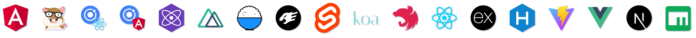

import { Card, CardGrid } from "@astrojs/starlight/components";

<CardGrid stagger>
  <Card title="Serverless First" icon="seti:html">
    基于 TypeScript，坚信 Serverless 是未来。
  </Card>
  <Card title="组件化" icon="puzzle">
    在 Malagu 的世界里：“一切皆组件”。
  </Card>
  <Card title="平台无关" icon="seti:ionic">
    适配任意的平台和基础框架，是一个平台或基础框架无关的上层框架。
  </Card>
</CardGrid>

## 支持 15+ 框架

目前 Malagu 生态包含了 Malagu Cli 和 Malagu Framework，其中，Malagu Cli 已支持如下框架和工具，可以享受 Malagu 带来的开发和部署的便利:

## 开源项目与社区发展

截至 2024 年 1 月，Malagu 经历了五年的打磨和真实项目实践，陆续发布了 321 个版本。目前 Malagu 核心部分已经稳定，拥有 10 位左右的核心共建成员。在微信小程序、钉钉小程序、uniapp、门户网站、内容管理平台、云文档平台等场景都有真实项目成功落地。我们自己每天都在用 Malagu 开发真实业务项目。 ​

在社区发展过程中，被越来越多的开发者和云厂商的认可，陆续有 29 位开发者加入到我们的社区共建团队。主要经历了这么几个阶段：

- 被阿里云开发者平台集成为多个场景解决方案；
- 受邀参加 2020 云原生微服务直播分享；
- 被阿里云函数计算的 Serverless Devs 工具集成；
- 受邀参加第三届腾讯运维技术开发日直播分享；
- 被腾讯云 Serverless 团队认可，并成为腾讯云函数首个合作的第三方开发框架；
- 参与 2022 【开源摘星计划】
- 2023 年成为 Gitee GVP 项目

## 贡献者

## 加入我们

Malagu 是 MIT 许可的开源项目。需要优秀人士的支持使它不断发展。如果您想加入我们，请联系我们，我们的邮箱是 kevin@cellbang.com。

