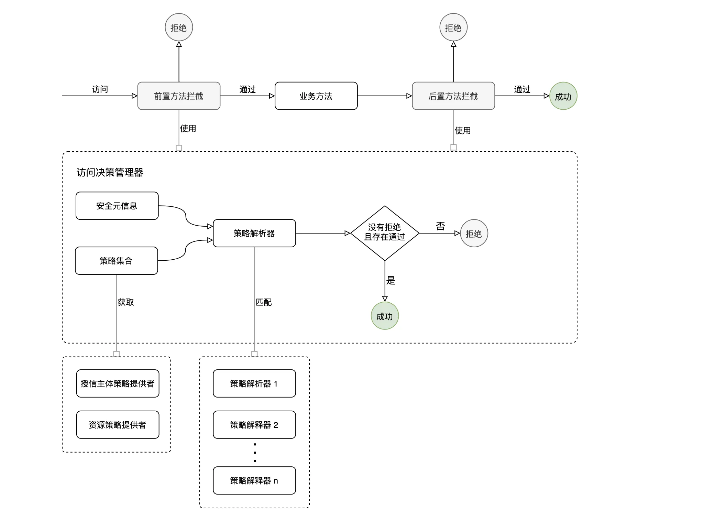
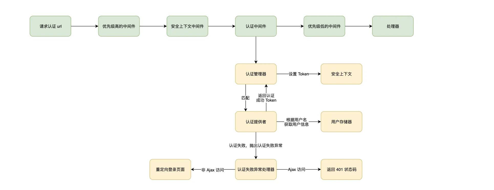

在这里阐述一些安全机制的概念，以便于您更好的理解`@Malagu/security`的安全机制。

## 访问控制机制



- 访问控制是通过 AOP 机制实现
- 访问控制过程包含前置访问控制和后置访问控制
- 安全元信息包含资源、操作、授信主体、授权类型和策略
- 通过安全元信息中的授信主体和资源名称，我们分别获得资源权限策略和授信主体权限策略，然后根据策略类型匹配合适的策略解释器，策略解析器根据安全元信息和策略进行解析。
- 一般情况下，一种类型的策略对应一个策略解释器，可以根据业务需要定义自己的策略语法规则。
- 策略可以所属授信主体，也可以所属资源，策略可以在代码写死，也可以配置文件配置，还可以存储在数据库当中
- 授信主体一般是系统用户，也可以是其他逻辑上的授信主体
- 访问控制过程中，在解释所有权限策略的时候，只要存在一条策略不通过，则拒绝访问；且必须存在一条策略是通过的，才能成功访问

## 认证机制



- 安全上下文中间件负责尝试从 Session 还原安全上下文内容
- 所有的请求都会到达认证管理器，认证管理器会尝试匹配认证提供，如果该请求没有匹配到认证提供者，则忽略，继续往下执行后面的中间件
- 认证管理器可能匹配到多个认证提供者，只要其中存在一个是认证通过的，则表示认证通过
- 框架默认的认证提供者会尝试从请求参数和 body 中获取用户名和密码，通过用户名从用户存储器中加载用户信息，用户不存在，则抛出认证异常，认证失败，如果存在，则会继续校验密码是否正确，另外还有一些其他用户状态的校验，都通过了，则认证成功
- 认证成功后，返回 Token，Token 中往往包含了用户基本信息，Token 会设置到安全上下文中，安全上下文中的内容会持久化到 Session 中
- 您可以通过实现自己认证提供者，满足自己业务特殊的认证需求
- 您可以通过属性配置自定义自己的登录页面地址、登录成功地址等等
- 密码加密采用随机盐 + 秘钥的  Pbkdf2 的哈希算法，框架提供了一个默认秘钥，真实场景记得一定要改成您自己的秘钥。当然，您也可以自定义哈希算法

## 认证提供者

`认证管理器`会将真正的`认证任务`委派给`认证提供者`，您也可以`自定义认证提供者`，只需要实现`AuthenticationProvider`，并以`AuthenticationProvider`接口为 id 注入到 IoC 容器即可。

### 类型定义

```typescript
export interface Authentication {
  name: string; // 认证主体的主键，认证主体一般是具体某个用户
  policies: Policy[]; // 认证主体拥有的权限策略信息
  credentials: any; // 认证凭证信息，如用户密码
  details?: any; // 额外附加的认证信息，比如 IP 地址
  principal: any; // 认证主体信息，一般是用户具体信息
  next?: boolean; // next 为 true，则继续执行后续的中间件
  authenticated: boolean; // authenticated 一般为 true，表示认证成功
}

export interface AuthenticationProvider {
  readonly priority: number;
  authenticate(): Promise<Authentication>;
  support(): Promise<boolean>;
}
```

`support`方法往往是匹配当前请求的路由是否为我们指定的即可。示例如下：

```typescript
class AuthenticationProviderImpl implements AuthenticationProvider {
  async support(): Promise<boolean> {
    return !!(await this.requestMatcher.match(this.options.loginUrl, this.options.loginMethod));
  }
}
```

### 默认实现

这是目前`AuthenticationProvider`注入的默认实现，您可以根据自己的业务需求自定义自己的认证提供者。

```typescript
@Component(AuthenticationProvider)
export class AuthenticationProviderImpl implements AuthenticationProvider {
  @Value("malagu.security")
  protected readonly options: any;

  @Autowired(PasswordEncoder)
  protected readonly passwordEncoder: PasswordEncoder;

  @Autowired(UserStore)
  protected readonly userStore: UserStore;

  @Autowired(UserChecker)
  protected readonly userChecker: UserChecker;

  @Autowired(RequestMatcher)
  protected readonly requestMatcher: RequestMatcher;

  priority = DEFAULT_AUTHENTICATION_PROVIDER__PRIORITY;

  async authenticate(): Promise<Authentication> {
    const username = this.doGetValue(this.options.usernameKey);
    const password = this.doGetValue(this.options.passwordKey);
    if (!password || !username) {
      throw new BadCredentialsError("Bad credentials");
    }
    const user = await this.userStore.load(username);
    await this.userChecker.check(user);
    if (!(await this.passwordEncoder.matches(password, user.password))) {
      throw new BadCredentialsError("Bad credentials");
    }

    Context.getResponse().statusCode = 302;
    Context.getResponse().setHeader("Location", this.options.loginSuccessUrl);

    return {
      principal: user,
      credentials: "",
      policies: user.policies,
      authenticated: true,
    };
  }

  protected doGetValue(key: string): string {
    const request = Context.getRequest();
    if (request.body) {
      return request.body[key];
    } else {
      return request.query[key];
    }
  }

  async support(): Promise<boolean> {
    return !!(await this.requestMatcher.match(this.options.loginUrl, this.options.loginMethod));
  }
}
```

## 安全元信息

### 定义

```typescript
export interface SecurityMetadata {
  authorizeType: AuthorizeType;
  action: string;
  resource: string;
  principal: any;
  policies: Policy[];
}
```

## 安全元信息上下文

`安全元信息源`会基于`安全元信息上下文`获得`安全元信息`。

### 定义

```typescript
export interface SecurityMetadataContext {}

export interface MethodSecurityMetadataContext extends SecurityMetadataContext {
  authorizeType: AuthorizeType;
  method: string;
  args: any[];
  target: any;
  returnValue?: any;
}
```

## 安全元信息源

可以基于安全元信息上下文获得安全元信息。

### 定义

```typescript
export interface SecurityMetadataSource {
  load(context: SecurityMetadataContext): Promise<SecurityMetadata>;
}
```

### 默认实现

```typescript
@Component(SecurityMetadataSource)
export class MethodSecurityMetadataSource implements SecurityMetadataSource {
  @Autowired(SecurityExpressionContextHandler)
  @Optional
  protected readonly securityExpressionContextHandler: SecurityExpressionContextHandler;

  async load(context: MethodSecurityMetadataContext): Promise<SecurityMetadata> {
    const classMetadatas: AuthorizeMetadata[] = getOwnMetadata(METADATA_KEY.authorize, context.target.constructor);
    const methodMetadatas: AuthorizeMetadata[] = getOwnMetadata(METADATA_KEY.authorize, context.target.constructor, context.method);
    const ctx = {
      ...context,
      ...SecurityContext.getAuthentication(),
    };
    Context.setAttr(SECURITY_EXPRESSION_CONTEXT_KEY, ctx);
    if (this.securityExpressionContextHandler) {
      await this.securityExpressionContextHandler.handle(ctx);
    }
    const policies = classMetadatas
      .concat(...methodMetadatas)
      .filter((item) => item.authorizeType === context.authorizeType)
      .map((item) => ({
        type: PolicyType.El,
        authorizeType: item.authorizeType,
        el: item.el,
      }));

    const resource = context.target.name;
    return {
      authorizeType: context.authorizeType,
      principal: SecurityContext.getAuthentication().principal,
      action: context.method,
      resource,
      policies: policies,
    };
  }
}
```

## 访问决策管理器

基于安全元信息进行访问决策。

### 定义

```typescript
export interface AccessDecisionManager {
  decide(securityMetadata: SecurityMetadata): Promise<void>;
}
```

### 默认实现

```typescript
@Component(AccessDecisionManager)
export class AccessDecisionManagerImpl implements AccessDecisionManager {
  protected prioritized: AccessDecisionVoter[];

  constructor(
    @Autowired(AccessDecisionVoter)
    protected readonly accessDecisionVoters: AccessDecisionVoter[]
  ) {
    this.prioritized = Prioritizeable.prioritizeAllSync(this.accessDecisionVoters).map((c) => c.value);
  }

  async decide(securityMetadata: SecurityMetadata): Promise<void> {
    let grant = 0;
    for (const voter of this.prioritized) {
      if (await voter.support(securityMetadata)) {
        const result = await voter.vote(securityMetadata);
        if (result === ACCESS_DENIED) {
          throw new AccessDeniedError("Access is denied");
        } else if (result === ACCESS_GRANTED) {
          grant++;
        }
      }
    }
    if (grant <= 0) {
      throw new AccessDeniedError("Access is denied");
    }
  }
}
```

## 访问决策投票器

访问决策管理器会把真正的决策任务委派给访问决策投票器。您也可以自定义认证提供者，只需要实现接口`AccessDecisionVoter`，并以`AccessDecisionVoter`接口为 id 注入到 IoC 容器即可。

### 定义

```typescript
export interface AccessDecisionVoter {
  vote(securityMetadata: SecurityMetadata): Promise<number>;
  support(securityMetadata: SecurityMetadata): Promise<boolean>;
  readonly priority: number;
}
```

### 默认实现

```typescript
@Component(AccessDecisionVoter)
export class PolicyBasedVoter implements AccessDecisionVoter {
  readonly priority = POLICY_BASED_VOTER_PRIORITY;

  @Autowired(PolicyResolver)
  protected readonly policyResolvers: PolicyResolver[];

  @Autowired(ResourcePolicyProvider)
  protected readonly resourcePolicyProvider: ResourcePolicyProvider;

  @Autowired(PrincipalPolicyProvider)
  protected readonly principalPolicyProvider: PrincipalPolicyProvider;

  async vote(securityMetadata: SecurityMetadata): Promise<number> {
    const principalPolicies = await this.principalPolicyProvider.provide(securityMetadata.principal, securityMetadata.authorizeType);
    const resourcePolicies = await this.resourcePolicyProvider.provide(securityMetadata.resource, securityMetadata.authorizeType);
    const policies = [...principalPolicies, ...resourcePolicies, ...securityMetadata.policies];
    let grant = 0;
    for (const policy of policies) {
      for (const policyResolver of this.policyResolvers) {
        if (await policyResolver.support(policy)) {
          if (await policyResolver.resolve(policy, securityMetadata)) {
            grant++;
          } else {
            return ACCESS_DENIED;
          }
        }
      }
    }
    if (securityMetadata.authorizeType === AuthorizeType.Post || grant > 0) {
      return ACCESS_GRANTED;
    }
    return ACCESS_DENIED;
  }

  async support(securityMetadata: SecurityMetadata): Promise<boolean> {
    return true;
  }
}
```
